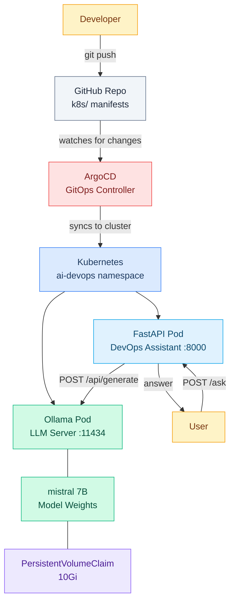
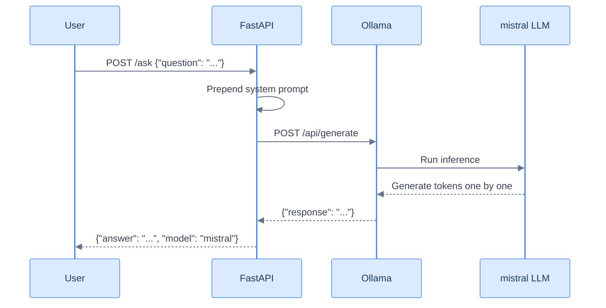
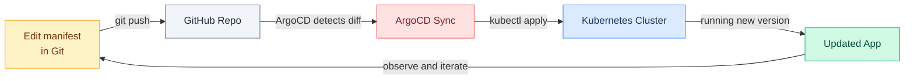

# local-k8s-ai-agent

A self-hosted AI DevOps assistant running a local LLM (no OpenAI API), exposed via FastAPI, and deployed to Kubernetes using GitOps with ArgoCD.



---

## Features

- **Chat UI** - clean web interface at `http://localhost:8000/` for asking questions visually (no terminal needed)
- **Two interaction modes:**
  - `Ask` - generic Kubernetes questions answered by the local LLM
  - `Diagnose Cluster` - the agent reads live pods, events, and logs from your namespace and reasons about the actual state (RAG pattern)
- **REST API** - `/ask` and `/diagnose` endpoints for programmatic access, plus auto-generated OpenAPI docs at `/docs`
- **GitOps deployment** - ArgoCD watches the Git repo and syncs changes automatically
- **100% local LLM** - no data leaves your cluster; runs `mistral` via Ollama
- **Read-only by design** - the agent has a `ServiceAccount` with read-only RBAC, so it can observe but never modify your cluster

### What the UI looks like

```
┌─────────────────────────────────────────────────┐
│  Local K8s AI Agent                             │  <- gradient header
│  Ask anything about Kubernetes                  │
├─────────────────────────────────────────────────┤
│  [ Ask ]  [ Diagnose Cluster ]                  │  <- mode toggle
├─────────────────────────────────────────────────┤
│  Namespace: [ ai-devops          ]              │  <- shown in Diagnose mode
├─────────────────────────────────────────────────┤
│                                                 │
│                          ┌──────────────────┐   │
│                          │ Why is my pod    │   │  <- user bubble
│                          │ crashing?        │   │
│                          └──────────────────┘   │
│  ┌──────────────────────────┐                   │
│  │ The pod `ollama-xyz` is  │                   │  <- bot bubble
│  │ in CrashLoopBackOff...   │                   │
│  │ ▸ Cluster state used     │                   │  <- expandable context
│  └──────────────────────────┘                   │
│                                                 │
├─────────────────────────────────────────────────┤
│  [ type your question...        ]   [ Send ]    │
└─────────────────────────────────────────────────┘
```

---

## Learn the AI Concepts

New to AI? Read [docs/ai-concepts.md](docs/ai-concepts.md) for a beginner-friendly explanation of every AI concept used in this project - LLMs, inference, system prompts, tokens, and more - all tied to the actual code.

---

## Requirements

- macOS or Linux
- 8 GB RAM minimum (16 GB recommended)
- 20 GB free disk space (for the LLM model)
- Docker Desktop or Docker Engine
- A Docker Hub account (free) - [hub.docker.com](https://hub.docker.com)
- A GitHub account

---

## Step 1 - Install Homebrew (macOS only)

```bash
/bin/bash -c "$(curl -fsSL https://raw.githubusercontent.com/Homebrew/install/HEAD/install.sh)"
```

Verify:

```bash
brew --version
```

---

## Step 2 - Install Docker Desktop

Download and install from [docker.com/products/docker-desktop](https://www.docker.com/products/docker-desktop/).

Verify:

```bash
docker --version
docker ps
```

---

## Step 3 - Install kubectl

```bash
brew install kubectl
```

Verify:

```bash
kubectl version --client
```

---

## Step 4 - Install minikube

```bash
brew install minikube
```

Verify:

```bash
minikube version
```

---

## Step 5 - Install Helm

```bash
brew install helm
```

Verify:

```bash
helm version
```

---

## Step 6 - Install GitHub CLI

```bash
brew install gh
```

Log in:

```bash
gh auth login
# Select: GitHub.com → HTTPS → Login with a web browser → follow prompts
```

Verify:

```bash
gh auth status
```

---

## Step 7 - Install ArgoCD CLI

```bash
brew install argocd
```

Verify:

```bash
argocd version --client
```

---

## Step 8 - Start minikube

```bash
minikube start --cpus=4 --memory=8g --disk-size=20g
```

Verify the cluster is running:

```bash
kubectl get nodes
# Expected: NAME       STATUS   ROLES           AGE   VERSION
#           minikube   Ready    control-plane   ...
```

> The API is accessed via `kubectl port-forward` (see Step 15), so no Ingress or Gateway controller is needed for local development. If you later deploy this to a real cluster, you can add a Gateway API resource at that point.

---

## Step 9 - Clone this repo

```bash
git clone https://github.com/MaryamTavakkoli/local-k8s-ai-agent.git
cd local-k8s-ai-agent
```

---

## Step 10 - Build and push the Docker image

Log in to Docker Hub:

```bash
docker login
# Enter your Docker Hub username and password
```

Build the image (replace `YOUR_DOCKERHUB_USERNAME` with your actual username):

```bash
docker build -t YOUR_DOCKERHUB_USERNAME/local-k8s-ai-agent:v1 .
```

Push to Docker Hub:

```bash
docker push YOUR_DOCKERHUB_USERNAME/local-k8s-ai-agent:v1
```

Update the image reference in the manifest:

```bash
sed -i '' 's|maryamtavakkoli/local-k8s-ai-agent:v1|YOUR_DOCKERHUB_USERNAME/local-k8s-ai-agent:v1|' k8s/api.yaml
```

Commit the change:

```bash
git add k8s/api.yaml
git commit -m "set docker image to my username"
git push
```

---

## Step 11 - Install ArgoCD on the cluster

```bash
kubectl create namespace argocd

kubectl apply -n argocd -f https://raw.githubusercontent.com/argoproj/argo-cd/stable/manifests/install.yaml
```

Wait for all ArgoCD pods to be ready:

```bash
kubectl wait --for=condition=available deployment \
  -l app.kubernetes.io/name=argocd-server \
  -n argocd \
  --timeout=180s
```

Get the initial admin password:

```bash
kubectl get secret argocd-initial-admin-secret -n argocd \
  -o jsonpath="{.data.password}" | base64 --decode && echo
```

Save this password - you will need it to log in.

---

## Step 12 - Access the ArgoCD UI

In a separate terminal, run:

```bash
kubectl port-forward svc/argocd-server -n argocd 8080:443
```

Open your browser at `https://localhost:8080`.

- Username: `admin`
- Password: the value from Step 11

> Accept the self-signed certificate warning in your browser.

Log in via the CLI as well:

```bash
argocd login localhost:8080 \
  --username admin \
  --password <PASTE_PASSWORD_HERE> \
  --insecure
```

---

## Step 13 - Register the private repo with ArgoCD

If this repo is private, ArgoCD needs credentials to read it. Pick one of the three options below. (Skip this step if your fork is public - ArgoCD can read public repos without credentials.)

### Option A - Reuse your GitHub CLI token (fastest)

```bash
GH_TOKEN=$(gh auth token)

argocd repo add https://github.com/MaryamTavakkoli/local-k8s-ai-agent.git \
  --username MaryamTavakkoli \
  --password "$GH_TOKEN"
```

### Option B - Create a dedicated Personal Access Token (more secure)

1. Go to https://github.com/settings/tokens/new
2. Note: `ArgoCD - local-k8s-ai-agent`
3. Expiration: pick a date
4. Scope: check `repo` only
5. Click `Generate token` and copy it

Then:

```bash
argocd repo add https://github.com/MaryamTavakkoli/local-k8s-ai-agent.git \
  --username MaryamTavakkoli \
  --password ghp_xxxxxxxxxxxxxxxxxxxx
```

### Option C - Through the ArgoCD UI

1. Open `https://localhost:8080`
2. Settings (gear icon, bottom left) -> `Repositories` -> `Connect Repo`
3. Choose method: `VIA HTTPS`
4. Type: `git`
5. Project: `default`
6. Repository URL: `https://github.com/MaryamTavakkoli/local-k8s-ai-agent.git`
7. Username: `MaryamTavakkoli`
8. Password: paste token from Option A or B
9. Click `Connect`

### Verify the repo is registered

```bash
argocd repo list
# Expected: TYPE  NAME  REPO                                                       ...  STATUS
#           git         https://github.com/MaryamTavakkoli/local-k8s-ai-agent.git  ...  Successful
```

---

## Step 14 - Deploy the app via ArgoCD

Apply the ArgoCD Application manifest:

```bash
kubectl apply -f k8s/argocd-app.yaml
```

Watch ArgoCD sync the app:

```bash
argocd app get local-k8s-ai-agent
argocd app sync local-k8s-ai-agent
```

Or watch in the UI at `https://localhost:8080`.

Check that all pods are running:

```bash
kubectl get pods -n ai-devops
```

Expected output (the Ollama pod takes 5–10 minutes on first start while it downloads the model):

```
NAME                             READY   STATUS    RESTARTS   AGE
ollama-xxx                       1/1     Running   0          8m
ai-devops-api-xxx                1/1     Running   0          2m
```

---

## Step 15 - Test the API



In a separate terminal, port-forward the API:

```bash
kubectl port-forward svc/ai-devops-api -n ai-devops 8000:80
```

### Option 1 - Use the chat UI (recommended)

Open in your browser:

```
http://localhost:8000/
```

You'll see the chat interface. Two modes available via the toggle at the top:

- **Ask** - type any Kubernetes question; the LLM answers from its training knowledge
- **Diagnose Cluster** - enter a namespace, ask a question; the agent reads live pods, events, and logs from that namespace and reasons about the actual state. Click `Cluster state used as context` under any answer to see exactly what data the agent read.

Responses take 1-2 minutes on CPU.

### Option 2 - Use the REST API directly

Health check:

```bash
curl http://localhost:8000/health
# {"status":"ok","k8s_api_available":true}
```

Ask a generic DevOps question (no cluster context):

```bash
curl -X POST http://localhost:8000/ask \
  -H "Content-Type: application/json" \
  -d '{"question": "My pod is in CrashLoopBackOff. What does this mean and how do I fix it?"}'
```

Diagnose your actual cluster (the agent reads live pods, events, and logs from the namespace):

```bash
curl -X POST http://localhost:8000/diagnose \
  -H "Content-Type: application/json" \
  -d '{"question": "Is anything wrong in this namespace?", "namespace": "ai-devops"}'
```

The response includes both the answer and the `context` the agent read from the cluster, so you can verify what it based its reasoning on.

List available models:

```bash
curl http://localhost:8000/models
```

### Option 3 - Interactive OpenAPI docs

FastAPI auto-generates Swagger UI:

```
http://localhost:8000/docs
```

You can try every endpoint from the browser without writing any curl.

---

## Step 16 - Automate Docker builds (optional, recommended)

Manually running `docker build` and `docker push` for every code change gets old fast. We can automate it using two open-source pieces - a pattern you'll see at any company running Argo CD at scale:

1. **GitHub Actions** builds and pushes the image (CI)
2. **ArgoCD Image Updater** detects the new image and updates `k8s/api.yaml` in Git automatically (CD)

```mermaid
graph LR
    A[Push code] -->|triggers| B[GitHub Actions]
    B -->|builds + pushes| C[Docker Hub]
    C -->|polled| D[Image Updater]
    D -->|writes new tag to Git| E[GitHub Repo]
    E -->|syncs| F[ArgoCD]
    F -->|deploys| G[Kubernetes]

    classDef dev  fill:#fef3c7,stroke:#f59e0b,color:#78350f
    classDef ci   fill:#e0f2fe,stroke:#0ea5e9,color:#0c4a6e
    classDef reg  fill:#ede9fe,stroke:#8b5cf6,color:#4c1d95
    classDef iu   fill:#fce7f3,stroke:#ec4899,color:#831843
    classDef git  fill:#f1f5f9,stroke:#64748b,color:#1e293b
    classDef argo fill:#fee2e2,stroke:#ef4444,color:#7f1d1d
    classDef k8s  fill:#dbeafe,stroke:#3b82f6,color:#1e3a5f

    class A dev
    class B ci
    class C reg
    class D iu
    class E git
    class F argo
    class G k8s
```



> **Why two pieces?** It's a classic platform engineering separation of concerns: **CI** builds artefacts, **CD** decides what runs in production. Image Updater is the tiny "promotion" robot in between - it watches the registry and updates Git, which is your single source of truth. The deploy step is unchanged - ArgoCD still syncs from Git, just like before.

### 16a - Create a Docker Hub access token

1. Go to https://hub.docker.com/settings/security
2. Click `New Access Token`
3. Description: `local-k8s-ai-agent GitHub Actions`
4. Permissions: `Read, Write, Delete`
5. Click `Generate` and copy the token

### 16b - Add the secrets to GitHub

1. Go to https://github.com/MaryamTavakkoli/local-k8s-ai-agent/settings/secrets/actions
2. Click `New repository secret` twice and add:
   - `DOCKERHUB_USERNAME` = your Docker Hub username (e.g. `marytvk`)
   - `DOCKERHUB_TOKEN` = the token from 16a

The GitHub Actions workflow at `.github/workflows/build-and-push.yml` triggers on every push that changes `app/`, `Dockerfile`, or the workflow file itself. It builds **multi-architecture images** (`linux/amd64` + `linux/arm64`) using `docker buildx` with QEMU emulation, then pushes a 7-character git SHA tag (e.g. `marytvk/local-k8s-ai-agent:8930dde`). Multi-arch matters because GitHub runners are amd64 but minikube on Apple Silicon is arm64 - a single-arch image won't run on both.

### 16c - Install ArgoCD Image Updater

```bash
kubectl apply -n argocd -f https://raw.githubusercontent.com/argoproj-labs/argocd-image-updater/stable/config/install.yaml
```

Wait for it to be ready:

```bash
kubectl wait --for=condition=available deployment/argocd-image-updater-controller -n argocd --timeout=180s
```

### 16d - Tell Image Updater which image to watch

Recent versions of Image Updater use a **CRD-based** configuration (not annotations on the Application). It also only supports **Kustomize or Helm** sources - which is why `k8s/` contains a `kustomization.yaml` listing the manifests and the image entry that Image Updater rewrites.

Apply the `ImageUpdater` resource:

```bash
kubectl apply -f argocd/image-updater.yaml
```

This resource tells Image Updater:

- Which ArgoCD Application to watch (`local-k8s-ai-agent`)
- Which image to track on Docker Hub (`marytvk/local-k8s-ai-agent` - note: no registry prefix, must match the image string as it appears on the live pod)
- Which tags to consider (regex `^[0-9a-f]{7}$` - 7-char git SHAs)
- Update strategy: `newest-build` - sort by image build time, pick the newest
- Write-back target: `kustomization:.` - rewrite the `newTag` in `k8s/kustomization.yaml` on `main`

> **Why a CRD instead of annotations?** Older Image Updater versions used `argocd-image-updater.argoproj.io/*` annotations on the ArgoCD `Application` resource. Recent versions were rewritten as a proper operator with a dedicated `ImageUpdater` CRD. The annotation approach is being phased out - if you're following an older tutorial that uses annotations, it won't work with the current operator.

> **Why Kustomize?** Image Updater needs a structured way to find and rewrite the image field. With a plain YAML "Directory" source, it has no way to know which `image:` line belongs to which app and how to safely edit it. Kustomize's `images:` section is its contract: Image Updater rewrites `newTag` and Kustomize applies the override at render time.

Confirm Image Updater sees the resource:

```bash
kubectl get imageupdater -n argocd
# NAME                 APPS   IMAGES   LAST CHECKED   READY
# local-k8s-ai-agent   1      1        15s            True

kubectl logs -n argocd deployment/argocd-image-updater-controller --tail=50 | grep local-k8s-ai-agent
```

### 16e - Verify Image Updater can write to the repo

Image Updater uses the same repo credentials you registered with ArgoCD in Step 13. Since you registered the repo using a GitHub PAT with `repo` scope, write-back works out of the box.

Confirm:

```bash
argocd repo list
# The repo should show STATUS = Successful
```

### 16f - Trigger the first automated build

Push any change to `app/`, for example:

```bash
echo "# Now with CI/CD" >> app/main.py
git add app/main.py
git commit -m "trigger first automated build"
git push
```

Then watch:

```bash
# Watch the GitHub Actions multi-arch build (~5-8 min due to arm64 emulation via QEMU)
gh run watch

# Once the image is pushed, watch Image Updater pick it up (polls every ~2 minutes)
kubectl logs -f -n argocd deployment/argocd-image-updater-controller
```

Within a few minutes you should see Image Updater detect the new tag and commit an update to `k8s/kustomization.yaml` on the `main` branch (commit message: `build: automatic update of local-k8s-ai-agent`). ArgoCD then syncs the new pod automatically.

### Troubleshooting the pipeline

**GitHub Actions fails with "unauthorized" on Docker Hub push** - check `DOCKERHUB_USERNAME` and `DOCKERHUB_TOKEN` are set correctly under repo Settings → Secrets and Actions.

**Image Updater doesn't pick up new images** - check the logs:

```bash
kubectl logs -n argocd deployment/argocd-image-updater --tail=100
```

Common causes:

- `"No ImageUpdater CRs to process"` - the `ImageUpdater` resource was never applied. Run `kubectl apply -f argocd/image-updater.yaml`.
- `"skipping app of type 'Directory'"` - the Application is set up as plain YAML manifests. Add a `kustomization.yaml` listing the resources (the repo already has one).
- `"Image seems not to be live in this application"` - the `imageName` in the CR doesn't match the live pod's image string. Drop any `docker.io/` prefix to match the canonical short form.
- `"Manifest platform: linux/amd64, requested: linux/arm64"` - the image is built for one arch but the node runs another. Build multi-arch (the workflow uses `docker buildx --platform linux/amd64,linux/arm64`).
- Tag doesn't match the `allowTags` regex (must be 7-char hex from the GitHub Actions build).
- Docker Hub rate-limiting (anonymous pulls cap at 100/6h).

**Image Updater detects the image but can't write back to Git** - the registered ArgoCD repo credentials need `repo` scope on GitHub. Re-register the repo with a token that has write access:

```bash
argocd repo add https://github.com/MaryamTavakkoli/local-k8s-ai-agent.git \
  --username MaryamTavakkoli \
  --password "$(gh auth token)"
```

---

## GitOps Workflow

Every change goes through Git - ArgoCD automatically syncs the cluster.



### Upgrade the API image

If you completed Step 16, the upgrade is fully automated. Just push code:

```bash
# Edit any file in app/ or the Dockerfile
git add app/
git commit -m "improve diagnose prompt"
git push
```

GitHub Actions builds a new multi-arch image, Image Updater detects it, updates `k8s/kustomization.yaml`, and ArgoCD syncs. No manual `docker build` or `sed` required.

**Manual fallback** (if you haven't set up CI/CD yet):

```bash
SHA=$(git rev-parse --short=7 HEAD)
docker buildx build --platform linux/amd64,linux/arm64 \
  -t YOUR_DOCKERHUB_USERNAME/local-k8s-ai-agent:$SHA --push .
sed -i '' "s/newTag:.*/newTag: $SHA/" k8s/kustomization.yaml
git add k8s/kustomization.yaml
git commit -m "upgrade api to $SHA"
git push
```

### Change the LLM model

Edit `k8s/ollama.yaml` - change `mistral` to any model from [ollama.com/library](https://ollama.com/library):

```yaml
# in initContainers command:
ollama pull llama3.2

# in containers env (api.yaml):
- name: MODEL
  value: "llama3.2"
```

Then:

```bash
git add k8s/
git commit -m "switch model to llama3.2"
git push
```

---

## Project Structure

```
local-k8s-ai-agent/
├── app/
│   ├── main.py            # FastAPI application
│   ├── requirements.txt   # Python dependencies
│   └── static/
│       └── index.html     # Chat UI served at /
├── Dockerfile             # Container image definition
├── k8s/
│   ├── kustomization.yaml # Kustomize entrypoint; Image Updater rewrites newTag here
│   ├── namespace.yaml     # ai-devops namespace
│   ├── ollama.yaml        # Ollama LLM deployment + PVC + service
│   ├── api.yaml           # FastAPI deployment + service + RBAC
│   └── argocd-app.yaml    # ArgoCD Application pointing to k8s/
├── argocd/
│   └── image-updater.yaml # ImageUpdater CR (applied manually to argocd ns)
├── .github/
│   └── workflows/
│       └── build-and-push.yml  # CI: builds and pushes image on every code push
├── docs/
│   └── ai-concepts.md     # Beginner-friendly AI concepts guide
└── README.md
```

---

## Troubleshooting

**Ollama pod stuck in Init state**

The first boot downloads ~4 GB. Check progress:

```bash
kubectl logs -n ai-devops -l app=ollama -c pull-model -f
```

**API returns 503**

Ollama is not ready yet. Check:

```bash
kubectl get pods -n ai-devops
kubectl logs -n ai-devops -l app=ai-devops-api
```

**ArgoCD shows OutOfSync**

Force a sync:

```bash
argocd app sync local-k8s-ai-agent --force
```

**minikube runs out of memory**

Stop and restart with more memory:

```bash
minikube stop
minikube delete
minikube start --cpus=4 --memory=10g --disk-size=20g
```
