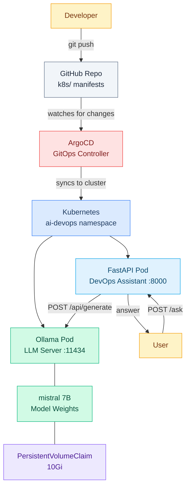
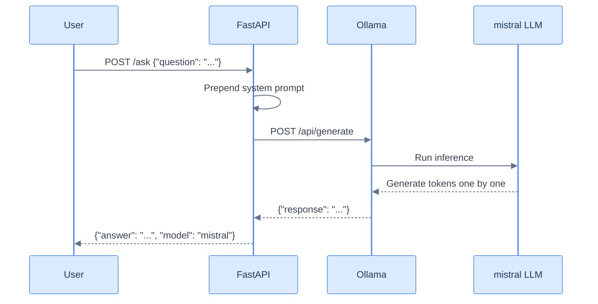
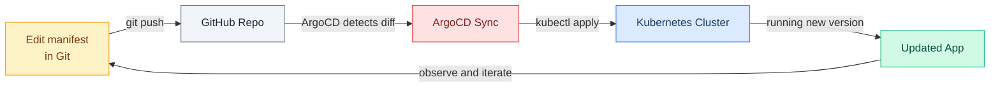

# local-k8s-ai-agent

A self-hosted AI DevOps assistant running a local LLM (no OpenAI API), exposed via FastAPI, and deployed to Kubernetes using GitOps with ArgoCD.



---

## Learn the AI Concepts

New to AI? Read [docs/ai-concepts.md](docs/ai-concepts.md) for a beginner-friendly explanation of every AI concept used in this project - LLMs, inference, system prompts, tokens, and more - all tied to the actual code.

---

## Requirements

- macOS or Linux
- 8 GB RAM minimum (16 GB recommended)
- 20 GB free disk space (for the LLM model)
- Docker Desktop or Docker Engine
- A Docker Hub account (free) - [hub.docker.com](https://hub.docker.com)
- A GitHub account

---

## Step 1 - Install Homebrew (macOS only)

```bash
/bin/bash -c "$(curl -fsSL https://raw.githubusercontent.com/Homebrew/install/HEAD/install.sh)"
```

Verify:

```bash
brew --version
```

---

## Step 2 - Install Docker Desktop

Download and install from [docker.com/products/docker-desktop](https://www.docker.com/products/docker-desktop/).

Verify:

```bash
docker --version
docker ps
```

---

## Step 3 - Install kubectl

```bash
brew install kubectl
```

Verify:

```bash
kubectl version --client
```

---

## Step 4 - Install minikube

```bash
brew install minikube
```

Verify:

```bash
minikube version
```

---

## Step 5 - Install Helm

```bash
brew install helm
```

Verify:

```bash
helm version
```

---

## Step 6 - Install GitHub CLI

```bash
brew install gh
```

Log in:

```bash
gh auth login
# Select: GitHub.com → HTTPS → Login with a web browser → follow prompts
```

Verify:

```bash
gh auth status
```

---

## Step 7 - Install ArgoCD CLI

```bash
brew install argocd
```

Verify:

```bash
argocd version --client
```

---

## Step 8 - Start minikube

```bash
minikube start --cpus=4 --memory=8g --disk-size=20g
```

Install the Gateway API CRDs (the modern successor to Ingress, GA since v1.0):

```bash
kubectl apply -f https://github.com/kubernetes-sigs/gateway-api/releases/download/v1.2.0/standard-install.yaml
```

Install Envoy Gateway as the Gateway controller:

```bash
kubectl apply --server-side -f https://github.com/envoyproxy/gateway/releases/download/v1.2.0/install.yaml
```

Wait for the controller to be ready:

```bash
kubectl wait --for=condition=available deployment/envoy-gateway -n envoy-gateway-system --timeout=180s
```

Verify the cluster is running and the GatewayClass exists:

```bash
kubectl get nodes
# Expected: NAME       STATUS   ROLES           AGE   VERSION
#           minikube   Ready    control-plane   ...

kubectl get gatewayclass
# Expected: NAME   CONTROLLER                      ACCEPTED   AGE
#           eg     gateway.envoyproxy.io/gatewayclass-controller   True   ...
```

> **Why Gateway API instead of Ingress?** Ingress is being superseded by the Gateway API, which is more expressive, role-oriented (separating cluster operator vs. app developer concerns), and supports advanced traffic features natively (header-based routing, traffic splitting, mTLS, etc.) without controller-specific annotations. Envoy Gateway is the official Envoy implementation of the Gateway API.

---

## Step 9 - Clone this repo

```bash
git clone https://github.com/MaryamTavakkoli/local-k8s-ai-agent.git
cd local-k8s-ai-agent
```

---

## Step 10 - Build and push the Docker image

Log in to Docker Hub:

```bash
docker login
# Enter your Docker Hub username and password
```

Build the image (replace `YOUR_DOCKERHUB_USERNAME` with your actual username):

```bash
docker build -t YOUR_DOCKERHUB_USERNAME/local-k8s-ai-agent:v1 .
```

Push to Docker Hub:

```bash
docker push YOUR_DOCKERHUB_USERNAME/local-k8s-ai-agent:v1
```

Update the image reference in the manifest:

```bash
sed -i '' 's|maryamtavakkoli/local-k8s-ai-agent:v1|YOUR_DOCKERHUB_USERNAME/local-k8s-ai-agent:v1|' k8s/api.yaml
```

Commit the change:

```bash
git add k8s/api.yaml
git commit -m "set docker image to my username"
git push
```

---

## Step 11 - Install ArgoCD on the cluster

```bash
kubectl create namespace argocd

kubectl apply -n argocd -f https://raw.githubusercontent.com/argoproj/argo-cd/stable/manifests/install.yaml
```

Wait for all ArgoCD pods to be ready:

```bash
kubectl wait --for=condition=available deployment \
  -l app.kubernetes.io/name=argocd-server \
  -n argocd \
  --timeout=180s
```

Get the initial admin password:

```bash
kubectl get secret argocd-initial-admin-secret -n argocd \
  -o jsonpath="{.data.password}" | base64 --decode && echo
```

Save this password - you will need it to log in.

---

## Step 12 - Access the ArgoCD UI

In a separate terminal, run:

```bash
kubectl port-forward svc/argocd-server -n argocd 8080:443
```

Open your browser at `https://localhost:8080`.

- Username: `admin`
- Password: the value from Step 11

> Accept the self-signed certificate warning in your browser.

Log in via the CLI as well:

```bash
argocd login localhost:8080 \
  --username admin \
  --password <PASTE_PASSWORD_HERE> \
  --insecure
```

---

## Step 13 - Register the private repo with ArgoCD

If this repo is private, ArgoCD needs credentials to read it. Pick one of the three options below. (Skip this step if your fork is public - ArgoCD can read public repos without credentials.)

### Option A - Reuse your GitHub CLI token (fastest)

```bash
GH_TOKEN=$(gh auth token)

argocd repo add https://github.com/MaryamTavakkoli/local-k8s-ai-agent.git \
  --username MaryamTavakkoli \
  --password "$GH_TOKEN"
```

### Option B - Create a dedicated Personal Access Token (more secure)

1. Go to https://github.com/settings/tokens/new
2. Note: `ArgoCD - local-k8s-ai-agent`
3. Expiration: pick a date
4. Scope: check `repo` only
5. Click `Generate token` and copy it

Then:

```bash
argocd repo add https://github.com/MaryamTavakkoli/local-k8s-ai-agent.git \
  --username MaryamTavakkoli \
  --password ghp_xxxxxxxxxxxxxxxxxxxx
```

### Option C - Through the ArgoCD UI

1. Open `https://localhost:8080`
2. Settings (gear icon, bottom left) -> `Repositories` -> `Connect Repo`
3. Choose method: `VIA HTTPS`
4. Type: `git`
5. Project: `default`
6. Repository URL: `https://github.com/MaryamTavakkoli/local-k8s-ai-agent.git`
7. Username: `MaryamTavakkoli`
8. Password: paste token from Option A or B
9. Click `Connect`

### Verify the repo is registered

```bash
argocd repo list
# Expected: TYPE  NAME  REPO                                                       ...  STATUS
#           git         https://github.com/MaryamTavakkoli/local-k8s-ai-agent.git  ...  Successful
```

---

## Step 14 - Deploy the app via ArgoCD

Apply the ArgoCD Application manifest:

```bash
kubectl apply -f k8s/argocd-app.yaml
```

Watch ArgoCD sync the app:

```bash
argocd app get local-k8s-ai-agent
argocd app sync local-k8s-ai-agent
```

Or watch in the UI at `https://localhost:8080`.

Check that all pods are running:

```bash
kubectl get pods -n ai-devops
```

Expected output (the Ollama pod takes 5–10 minutes on first start while it downloads the model):

```
NAME                             READY   STATUS    RESTARTS   AGE
ollama-xxx                       1/1     Running   0          8m
ai-devops-api-xxx                1/1     Running   0          2m
```

---

## Step 15 - Test the API



In a separate terminal, port-forward the API:

```bash
kubectl port-forward svc/ai-devops-api -n ai-devops 8000:80
```

Health check:

```bash
curl http://localhost:8000/health
# {"status":"ok"}
```

Ask a DevOps question:

```bash
curl -X POST http://localhost:8000/ask \
  -H "Content-Type: application/json" \
  -d '{"question": "My pod is in CrashLoopBackOff. What does this mean and how do I fix it?"}'
```

List available models:

```bash
curl http://localhost:8000/models
```

Open the chat UI in your browser:

```
http://localhost:8000/
```

Type a question and hit Send. Responses take 1-2 minutes on CPU.

Browse the interactive API docs:

```
http://localhost:8000/docs
```

---

## GitOps Workflow

Every change goes through Git - ArgoCD automatically syncs the cluster.



### Upgrade the API image

```bash
# 1. Build and push a new image
docker build -t YOUR_DOCKERHUB_USERNAME/local-k8s-ai-agent:v2 .
docker push YOUR_DOCKERHUB_USERNAME/local-k8s-ai-agent:v2

# 2. Update the manifest
sed -i '' 's/:v1/:v2/' k8s/api.yaml

# 3. Push - ArgoCD handles the rest
git add k8s/api.yaml
git commit -m "upgrade api to v2"
git push
```

### Change the LLM model

Edit `k8s/ollama.yaml` - change `mistral` to any model from [ollama.com/library](https://ollama.com/library):

```yaml
# in initContainers command:
ollama pull llama3.2

# in containers env (api.yaml):
- name: MODEL
  value: "llama3.2"
```

Then:

```bash
git add k8s/
git commit -m "switch model to llama3.2"
git push
```

---

## Project Structure

```
local-k8s-ai-agent/
├── app/
│   ├── main.py            # FastAPI application
│   ├── requirements.txt   # Python dependencies
│   └── static/
│       └── index.html     # Chat UI served at /
├── Dockerfile             # Container image definition
├── k8s/
│   ├── namespace.yaml     # ai-devops namespace
│   ├── ollama.yaml        # Ollama LLM deployment + PVC + service
│   ├── api.yaml           # FastAPI deployment + service + Gateway + HTTPRoute
│   └── argocd-app.yaml    # ArgoCD Application pointing to this repo
└── README.md
```

---

## Troubleshooting

**Ollama pod stuck in Init state**

The first boot downloads ~4 GB. Check progress:

```bash
kubectl logs -n ai-devops -l app=ollama -c pull-model -f
```

**API returns 503**

Ollama is not ready yet. Check:

```bash
kubectl get pods -n ai-devops
kubectl logs -n ai-devops -l app=ai-devops-api
```

**ArgoCD shows OutOfSync**

Force a sync:

```bash
argocd app sync local-k8s-ai-agent --force
```

**minikube runs out of memory**

Stop and restart with more memory:

```bash
minikube stop
minikube delete
minikube start --cpus=4 --memory=10g --disk-size=20g
```
