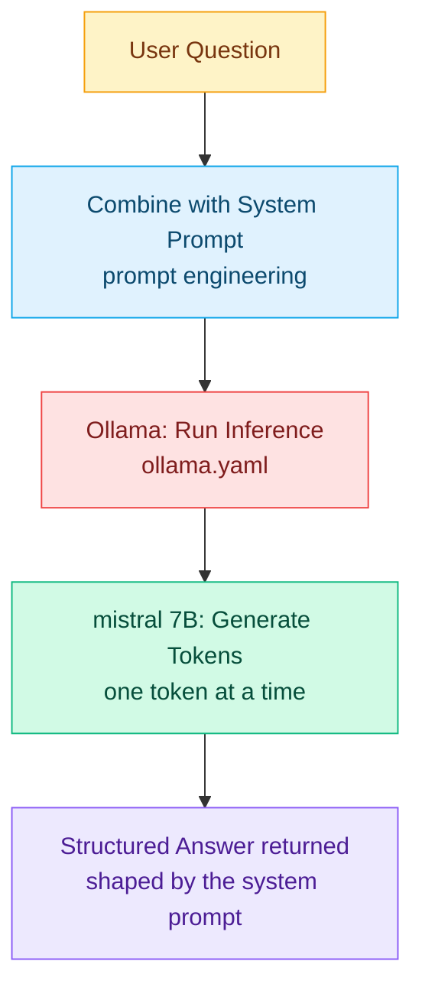

# AI Concepts Explained

A beginner-friendly guide to every AI concept used in this project, grounded in the actual code.

---

## 1. LLM - Large Language Model

**In the code:** `k8s/ollama.yaml` line 22 - `ollama pull mistral`

An LLM is a type of AI that has been trained on enormous amounts of text (books, websites, code, documentation) and learned to predict what words come next. That simple task, done at massive scale, produces a model that can answer questions, explain errors, write code, and hold a conversation.

`mistral` is the specific LLM used here. It is a 7-billion-parameter open-source model - "parameters" are the numbers the model learned during training, like the weights in a brain's neural connections. Bigger parameter counts generally mean more capable but slower and more resource-hungry models.

**Key point:** an LLM is not a database that looks things up - it generates text by predicting the most likely continuation of what you gave it.

---

## 2. Local / Self-Hosted LLM

**In the code:** `k8s/ollama.yaml` - the entire file runs Ollama inside your own cluster

Most AI products (ChatGPT, Claude, Gemini) send your text to a company's server to get a response. This project does the opposite - it runs the model entirely on your own machine or cluster. No data leaves your environment.

This matters for:
- **Privacy** - your Kubernetes errors and internal commands never leave your infrastructure
- **Cost** - no per-token API fees
- **Control** - you choose the model, the hardware, the version

The tradeoff is that a self-hosted 7B model is less capable than GPT-4 or Claude, and you need the hardware to run it.

---

## 3. Ollama

**In the code:** `k8s/ollama.yaml`, `app/main.py` lines 8 and 43

Ollama is an open-source tool that allows you to run large language models (LLMs) directly on your local machine. Ollama is not an AI model itself - it is a **model serving runtime**. Think of it like a web server, but instead of serving web pages, it serves LLM responses. It:

- Downloads and stores model files (that's what `ollama pull mistral` does)
- Loads the model into memory
- Exposes a REST API on port `11434` so other services can send prompts and get responses back

In `main.py`, the FastAPI app calls Ollama at `http://ollama:11434/api/generate` - the application never touches the model directly, it just sends HTTP requests to Ollama.

---

## 4. Inference

**In the code:** `app/main.py` lines 35–43 - the `POST /api/generate` call

"Inference" is the act of running a trained model to get an answer. Training (which happened before you downloaded `mistral`) is when the model learned from data. Inference is when you use that already-trained model to answer a question.

Every time someone calls `POST /ask`, Ollama runs one inference - it feeds the question into the model and generates a response token by token.

This is why Ollama needs 4–6 GB of RAM (`ollama.yaml` lines 32–37) - the model's billions of parameters have to be loaded into memory to run inference.

---

## 5. System Prompt

**In the code:** `app/main.py` lines 11–16

```python
SYSTEM_PROMPT = """You are a DevOps assistant specializing in Kubernetes.
When given an error or question, you:
1. Explain what it means clearly
2. Provide the exact kubectl commands to diagnose or fix it
3. Explain why the fix works
Be concise and practical."""
```

A system prompt is instructions you give the model *before* the user's question. The model reads it first and uses it to shape every response. Without it, `mistral` would behave as a general assistant. With it, it behaves as a Kubernetes specialist that always returns structured answers with commands.

This is one of the most important concepts in applied AI - you don't need to retrain a model to change its behavior. You just change the system prompt. This technique is called **prompt engineering**.

---

## 6. Prompt

**In the code:** `app/main.py` line 37 - `"prompt": query.question`

The prompt is the actual question or input sent to the model at runtime - what the user typed. The model sees both the system prompt and the user prompt together, and generates a response that satisfies both.

```
[system prompt] → sets the persona and rules
[user prompt]   → "My pod is in CrashLoopBackOff"
[model output]  → explanation + kubectl commands
```

The system prompt is set by the developer. The user prompt comes from whoever is calling the API.

---

## 7. Token

**In the code:** implied by `timeout=120.0` in `main.py` line 41

LLMs don't read words - they read **tokens**, which are chunks of text (roughly ¾ of a word on average). The sentence "CrashLoopBackOff" is about 3–4 tokens. The model generates one token at a time, which is why longer answers take longer.

The 120-second timeout exists because generating a detailed response with code examples can produce hundreds of tokens, which takes time on CPU without a GPU.

---

## 8. Model Parameters - Temperature and Streaming

**In the code:** `app/main.py` line 39 - `"stream": False`

`stream: False` tells Ollama to wait until the entire response is generated before returning it. The alternative, `stream: True`, sends tokens back one by one as they are generated (like watching ChatGPT type). This project uses non-streaming for simplicity.

Other parameters you can add to the payload:

**`temperature`** — recommended `0.1`–`0.3`

Controls how random or predictable the model's output is. At `0.0` the model always picks the single most likely next token, giving deterministic, focused answers. At `1.0` it picks more freely from less likely tokens, producing creative but sometimes inaccurate output. For a DevOps assistant, you want low temperature because correctness matters — a `kubectl` command that is "creatively" wrong will break things. Keep it between `0.1` and `0.3` so the model stays precise but still phrases answers naturally.

**`top_p`** — recommended `0.9`

Works alongside temperature to limit which tokens the model can choose from. At `0.9`, the model only considers the smallest set of tokens whose combined probability adds up to 90%, ignoring the long tail of unlikely options. This prevents truly bizarre word choices while still allowing natural variation. At `1.0` everything is on the table; at `0.1` the model becomes very rigid. `0.9` is a safe default for most use cases.

**`num_predict`** — recommended `512`–`1024`

Sets a hard cap on how many tokens the model generates per response. Without a limit, the model can ramble. For DevOps answers — an explanation plus a few `kubectl` commands — 512 tokens (roughly 380 words) is usually enough. Set it to `1024` if you want room for longer step-by-step explanations. Going higher wastes time and memory without adding useful content for this type of assistant.

---

## 9. REST API as the AI Interface

**In the code:** `app/main.py` - the entire FastAPI app wrapping Ollama

Rather than users talking to Ollama directly, the FastAPI app sits in between and:

1. Accepts a clean `{"question": "..."}` input
2. Injects the system prompt automatically
3. Calls Ollama
4. Returns a clean `{"answer": "...", "model": "..."}` output

This pattern - wrapping an LLM with a custom API - is how almost every AI product is built. The model is the brain; the API layer is what makes it useful for a specific task.

---

## 10. AI Agent

**In the code:** `app/main.py` - the `/diagnose` endpoint and `gather_namespace_context` function

"AI agent" means an AI that takes actions based on input, rather than just answering questions in isolation. The key difference from `/ask` is that the agent **observes the real world before reasoning**.

This project implements an agent through `/diagnose`:

1. **Observe** - the API uses the Kubernetes Python client to read live cluster state (pods, events, logs) from a given namespace
2. **Augment** - that real state is injected into the prompt before sending to the LLM
3. **Reason** - mistral sees the actual data and answers grounded in it, referencing specific pods and events

This pattern is called **retrieval-augmented generation (RAG)** at the simplest level, or **tool-use** when the model itself chooses what to fetch. Here we do the simpler version: the API always fetches a fixed set of cluster data, then asks the model.

The agent runs inside the cluster with a `ServiceAccount` and a read-only `ClusterRole` (see `k8s/api.yaml`). This means:
- The agent can only **read**, never modify the cluster - safe by design
- The Kubernetes API trusts the pod via in-cluster credentials, no kubeconfig needed
- A more advanced agent could add write permissions and an "observe → think → act → observe again" loop, but every action would need careful guardrails

A still more advanced agent would let the LLM **choose** which kubectl-equivalent calls to make (function calling / tool use). Mistral's open-weight version has limited tool-use support, so this project sticks with the fixed-context pattern.

---

## How It All Fits Together



Every AI product you use - from ChatGPT to GitHub Copilot - follows this same flow. This project gives you a working version of it that you fully own and control.
